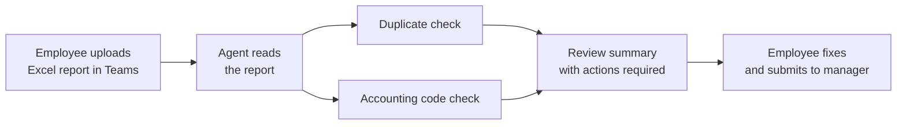

# Expense Report Reviewer Agent

## 1. Project Overview

The Expense Report Reviewer Agent is an AI agent in Microsoft Teams that checks an employee's expense report before it goes to a manager. The employee uploads their Excel expense report in a chat, and the agent reads it, looks for duplicate items, checks that each expense has the right accounting code, and returns a clear summary of what needs to be fixed.

* **Use case:** Pre-submission review of travel and expense reports
* **Intended audience:** Employees preparing expense claims, and the finance teams and managers who approve them
* **Main technologies:** An AI agent used through Microsoft Teams chat, reviewing an Excel (.xlsx) travel expense report

## 2. Business Problem & Objectives

### Problem

Expense reports often contain mistakes such as items entered twice or expenses filed under the wrong accounting code. These errors are usually found late, by a manager or finance reviewer, which means reports get sent back, corrected and resubmitted. Checking every line by hand is slow and repetitive.

### Current Process

The employee fills in an Excel "Travel Expenses Report" with each item's vendor, date, amount and accounting code, then submits it to their manager for approval.

### Objectives

* Catch common errors before the report reaches the manager
* Flag duplicate expense items for the employee to confirm
* Check each item against the correct accounting codes
* Give the employee a clear, actionable summary of what to fix
* Make the review available inside Teams, where employees already work

## 3. Solution

The employee chats with the agent in Teams and shares the expense report file. The agent works through the report in stages, posting progress messages as it goes.

### End-to-End Workflow

1. **Start the review:** The employee asks the agent to look at their report, and the agent asks them to upload it to the chat.
2. **Upload:** The employee attaches the Excel file "Travel Expenses Report".
3. **Read the report:** The agent confirms it is reading the report, then that it has read it and will run checks for errors.
4. **Check for duplicates:** The agent flags items that look like duplicates. In the demo, it finds two Singapore Airlines charges of $850.00 on 2025-11-14 and 2025-11-15.
5. **Check accounting codes:** The agent reviews all 12 items against their accounting codes (for example 5001 Meals & Entertainment, 5002 Airfare, 5003 Ground Transportation, 5004 Hotel & Lodging and 5007 Office Supplies). It shows a table marking each item Correct or Incorrect, and it flags NTUC FairPrice ($999.99), coded as 5007 Office Supplies, for recoding to 5001 Meals & Entertainment.
6. **Summarize:** The agent posts an "Expense Report Review Summary" with the employee name, submission date and report total ($5,058.89), a table of duplicate items, a table of misclassified items with the current and correct codes, an "Action Required" note for each issue, and confirmation that the remaining 10 items have no issues.
7. **Fix and submit:** The employee is asked to address the flagged items before submitting the report to their manager for approval.

## 4. Solution Architecture & Technologies

| Component | Role |
|---|---|
| **AI agent** ("Expense Report Reviewer Agent") | Reads the report, applies the review checks and writes the findings |
| **Microsoft Teams** | The chat interface where employees interact with the agent and upload files |
| **Excel expense report** (.xlsx) | The input: a travel expense report with vendor, date, amount and accounting code for each item |
| **Accounting code reference** | The codes used to judge each item. A citation marker on the recommended code suggests the agent draws on a reference source. |

The platform used to build the agent, and its knowledge sources, are not shown in the demonstration.

## 5. Controls & Validation

* **Duplicate detection:** Items with the same vendor, amount and code on close dates are flagged for the employee to confirm, not removed automatically
* **Accounting code validation:** Every item is checked against the expected accounting code and marked Correct or Incorrect
* **Explained recommendations:** Each flagged item comes with a reason and a suggested fix, such as the correct code to use
* **Human-in-the-loop:** The agent recommends but does not change the report. The employee decides what to correct before submitting.
* **Pre-approval checkpoint:** The review happens before the report goes to the manager, so errors are caught earlier in the process

## 6. Business Value

* **Fewer rejected reports:** Duplicates and coding errors are caught before submission
* **Less manual checking:** Employees and approvers do not need to review every line by hand
* **Faster approvals:** Managers receive cleaner reports that need fewer corrections
* **Consistency:** Every report is checked against the same rules and codes
* **Better user experience:** The review happens in Teams, in plain language, with clear next steps

## 7. Skills Demonstrated

* Finance process analysis for expense review and approval
* AI agent design for document review in Microsoft Teams
* Prompt and instruction design for multi-step checks and structured output
* Business rule definition for duplicate detection and accounting code validation
* Designing clear, actionable output (tables, status markers and action notes)
* Testing an agent end to end with a realistic expense report

## 8. Future Enhancements

The following are **potential future enhancements**, not existing functionality:

* **Hide the agent's internal reasoning:** In the demo, the agent posts its working notes into the chat (for example "Actually wait - STRICTLY DO NOT send any messages other than described in step…"). Its instructions should be tightened so only the final review is shown.
* **Stop repeated runs:** After the summary, the agent starts reading the report again. It should finish once the summary is delivered.
* **Review the code rules:** The agent recommends recoding a supermarket purchase (NTUC FairPrice, $999.99) from Office Supplies to Meals & Entertainment. That rule should be checked with finance, and large grocery purchases may need their own review.
* **Clean up messages:** Fix the "upload your expense report to the the chat window" typo, and stop the user's message appearing with raw "
" tags.
* **More checks:** Add receipt checks, policy limits per category, and date checks against the travel period.
* **Hand-off:** Let the employee submit the corrected report for approval directly from the chat.

---

## Final Summary

The Expense Report Reviewer Agent is an AI agent in Microsoft Teams that reviews expense reports before they reach a manager. Employees upload their Excel report in a chat, and the agent checks every item for duplicates and incorrect accounting codes. It returns a clear summary with tables, status markers and action notes, such as a possible duplicate flight and a miscoded purchase. Errors are caught earlier, reducing rework for employees and approvers.
