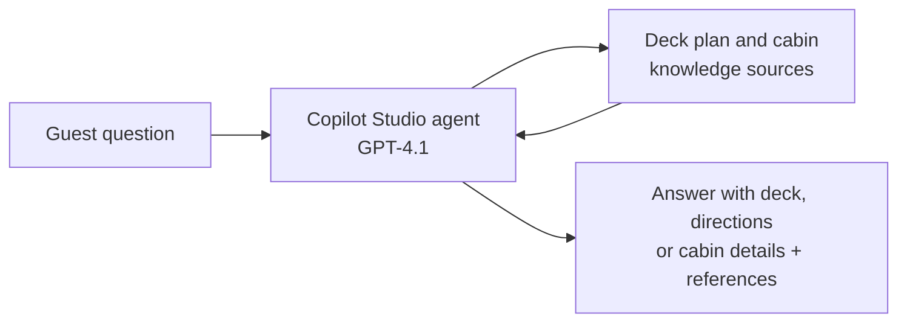

# Holland America Deck Plans Agent

## 1. Project Overview

The Holland America Deck Plans Agent is a conversational AI agent that answers questions about the layout of Holland America Line cruise ships. Guests can ask where a venue is, how to get from one place to another on board, or whether a specific stateroom meets their needs, and the agent replies with clear answers based on deck plan sources, with references.

* **Use case:** Answering ship layout, venue location and stateroom questions for cruise guests
* **Intended audience:** Cruise guests planning or taking a trip, and the travel advisors or guest services staff who help them
* **Main technologies:** Microsoft Copilot Studio (agent "Holland America Deck Plans") with GPT-4.1 as the agent's model, grounded in deck plan knowledge sources

## 2. Business Problem & Objectives

### Problem

Deck plans contain a lot of detail. Finding the right deck for a venue, working out a route between two places, or checking whether a cabin is accessible usually means reading through large diagrams and cabin legends. Guests often end up asking guest services or travel advisors the same questions again and again.

### Objectives

* Answer ship layout questions in plain language
* Give step-by-step directions between places on board
* Help guests check stateroom details, such as cabin category and accessibility
* Base answers on official deck plan sources and show references
* Keep the agent focused on deck plan and stateroom topics

## 3. Solution

The agent's instructions define its scope:

* Answer questions about deck layouts on Holland America ships
* Explain cabin types and their locations (for example Oceanview, Verandah and Suites)
* Guide users to choose ideal staterooms based on preferences (quiet, mid-ship, near elevators)
* Provide details about public spaces such as pools, restaurants, theaters and lounges by deck
* Differentiate between ship classes (for example Pinnacle and Signature Class)
* Offer general tips on cabin selection and motion sensitivity

### End-to-End Workflow

1. **Ask about a venue:** The user asks, "Which deck is the casino on the Rotterdam?" The agent answers that the casino is on the Promenade Deck (Deck 3), describes what it offers, lists other public spaces on that deck, and cites a Rotterdam deck 3 plan.
2. **Ask for directions:** The user follows up with "How do I get to the sport court from there?" The agent uses the earlier context and gives step-by-step directions from the casino on Deck 3 to the Sport Court on the Sun Deck (Deck 12), with tips on using the elevators and stairwells.
3. **Ask about nearby amenities:** The user asks for the closest bar to the Sea View Pool, and the agent responds with an answer titled "Closest Bar to the Sea View Pool on Rotterdam".
4. **Check a stateroom:** The user asks, "Is room VC6154 a handicap accessible room?" The agent explains that VC6154 is a Category VC Verandah Stateroom on the Mozart Deck and is not an accessible room, notes that accessible staterooms are listed separately in the deck plan legend, and offers to list accessible cabins instead. This answer cites two references.

Each answer is marked "Based on official sources" and shows the references it used.

## 4. Solution Architecture & Technologies

| Component | Role |
|---|---|
| **Microsoft Copilot Studio** | Platform used to build and test the agent, including its description, instructions and knowledge |
| **GPT-4.1** | The agent's model for understanding questions and generating responses |
| **Knowledge sources** | Deck plan and cabin pages for the ship (for example "Rotterdam Deck Plans" and "Rotterdam Cabin VC6154"), used to ground answers and shown as references |
| **Agent instructions** | Define the topics the agent covers and how it should help guests |

The exact knowledge source configuration (the Knowledge tab) is not opened in the demonstration.

## 5. Controls & Validation

* **Grounded answers:** Responses are marked "Based on official sources" and include numbered references to the deck plan pages used
* **Defined scope:** The instructions limit the agent to deck layouts, cabins, public spaces, ship classes and cabin selection tips
* **Context awareness:** Follow-up questions such as "from there" are answered using the earlier conversation
* **Clear, cautious answers:** For the accessibility question, the agent explains how accessible rooms are identified in the deck plan legend and offers alternatives
* **Testing:** The agent is tested in Copilot Studio's "Test your agent" pane, with thumbs up and thumbs down feedback on each response

## 6. Business Value

* **Faster answers for guests:** Layout and cabin questions are answered in seconds, at any time
* **Less load on staff:** Routine "where is" and "which deck" questions no longer need a person
* **Better planning:** Guests can check stateroom details, such as accessibility, before booking
* **Trustworthy information:** References let users check each answer against the source
* **Better onboard experience:** Step-by-step directions make a large ship easier to navigate

## 7. Skills Demonstrated

* Customer service and guest experience analysis
* AI agent design in Microsoft Copilot Studio
* Writing agent instructions to define scope and behavior
* Grounding an agent in knowledge sources with citations
* Multi-turn conversation design that keeps context
* Testing an agent with realistic guest questions

## 8. Future Enhancements

The following are **potential future enhancements**, not existing functionality:

* **More ships:** Add deck plans for other ships in the fleet, and let users choose the ship at the start of the chat
* **Accessible cabin list:** Return a list of accessible staterooms by category and deck when asked
* **Visual deck maps:** Show the relevant part of the deck plan image alongside the answer
* **Preference-based recommendations:** Ask about budget, location and motion sensitivity, then suggest suitable staterooms
* **Publish to a channel:** Deploy the agent to a website or Teams so guests or advisors can use it outside the test pane
* **Clarify affiliation:** As a portfolio project using a real cruise line's name and logo, add a note that it is a personal demonstration and not an official Holland America Line service

---

## Final Summary

The Holland America Deck Plans Agent is a Copilot Studio AI agent, powered by GPT-4.1, that helps cruise guests understand ship layouts. It answers questions such as which deck a venue is on, how to get between two places on board, and whether a stateroom is accessible, with every answer grounded in deck plan sources and shown with references. The agent gives guests fast, reliable answers and reduces routine questions for staff.
