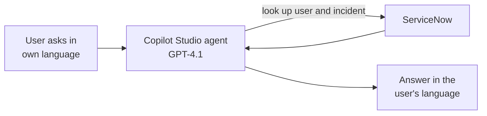

# Intelligent IT Helpdesk Support (AI Agent)

## 1. Project Overview

Intelligent IT Helpdesk Support is a conversational AI agent that helps employees check the status of their IT helpdesk tickets without contacting the service desk. The user identifies themselves by email, gives an incident number, and the agent returns the ticket's status, priority, dates, description and category from ServiceNow. It can also answer questions from the user's profile, and it responds in the user's own language.

* **Use case:** Self-service IT ticket status lookup and helpdesk support
* **Intended audience:** Employees who raise IT incidents, and IT service desk teams who want to reduce routine status queries
* **Main technologies:** Microsoft Copilot Studio (agent "Intelligent IT Helpdesk Support"), GPT-4.1 as the agent's model, and ServiceNow as the source of incident and user data

## 2. Business Problem & Objectives

### Problem

Employees often contact the IT service desk just to ask "What is the status of my ticket?". These routine questions take agents' time away from fixing issues, and users have to wait for an answer that is already recorded in the ticketing system. In multinational teams, language can be an extra barrier.

### Objectives

* Let users check their own ticket status at any time
* Identify the user before sharing ticket or profile details
* Return clear, accurate ticket information straight from ServiceNow
* Answer follow-up questions in the same conversation
* Respond in the user's language automatically

## 3. Solution

The agent is built and tested in Copilot Studio. Its description sets its scope: helping users check the status of their IT helpdesk tickets (incidents), providing information from knowledge articles on company IT and HR policies, and handling common IT scenarios, with automatic detection of the user's language.

### End-to-End Workflow

1. **Greeting:** The agent introduces itself and asks for the email address the user has registered in ServiceNow.
2. **Identify the user:** The user gives their email address (in German in the demo, "Hier ist meine E-Mail-Adresse: david.miller@example.com"). The agent recognizes the user as David Miller.
3. **Language detection:** The agent switches to German and asks how it can help: checking a ticket's status, IT or HR policy information, or support with an IT problem.
4. **Request the incident number:** When the user asks about their ticket, the agent asks for the incident number and explains the expected format ("INC" followed by seven digits).
5. **Return ticket details:** For incident INC0009009, the agent reports that the ticket is active with status "New" and low priority, gives its opened and last-updated dates, quotes the problem description (no access to a shared folder) and confirms that it is still being worked on.
6. **Answer follow-up questions:** The agent answers that the ticket's category is "Inquiry / Help" and, from the user's profile, that the user works in the "Product Management" department.

## 4. Solution Architecture & Technologies

| Component | Role |
|---|---|
| **Microsoft Copilot Studio** | Platform used to build, test and publish the agent, including its description, instructions, knowledge, tools and topics |
| **GPT-4.1** | The agent's model for reasoning and generating responses (selected as the default model) |
| **ServiceNow** | Source of incident records (status, priority, dates, description, category) and user profile data such as department |
| **Language detection** | Lets the agent detect the user's language and respond in it |

The specific tools, connectors and knowledge sources configured in the agent are not opened in the demonstration.

## 5. Controls & Validation

* **User identification:** The agent asks for the user's registered ServiceNow email address before helping, and confirms it has recognized the user
* **Input guidance:** The agent tells the user the expected incident number format ("INC" followed by seven digits) before looking up a ticket
* **Grounded answers:** Ticket details and the user's department are returned from ServiceNow records, not invented by the model
* **Defined scope:** The agent's description limits it to ticket status, IT and HR policy information and common IT scenarios
* **Testing before release:** The agent is tested in Copilot Studio's "Test your agent" pane, and the page shows a publish date of 21 February 2026

## 6. Business Value

* **Less load on the service desk:** Routine ticket status questions are handled by the agent
* **Faster answers:** Users get ticket details immediately, at any time, without waiting for an agent
* **Better user experience:** Users can ask in plain language and in their own language
* **Accuracy:** Answers come straight from the ticketing system, so users see the current status
* **Consistency:** Every user gets the same process and the same quality of answer

## 7. Skills Demonstrated

* IT service management process analysis (incident status and self-service)
* AI agent design in Microsoft Copilot Studio
* Writing agent descriptions and instructions to define scope and behavior
* Integrating an AI agent with ServiceNow incident and user data
* Multilingual conversational design with automatic language detection
* Conversation design for identification, input guidance and follow-up questions
* Testing and publishing an AI agent

## 8. Future Enhancements

The following are **potential future enhancements**, not existing functionality:

* **Stronger identity check:** Use the signed-in user's account instead of a typed email address, so users can only see their own tickets
* **Create and update tickets:** Let users open new incidents or add comments to existing ones through the agent
* **List my tickets:** Show all of a user's open tickets, so they do not need to know the incident number
* **Hand off to a human:** Escalate to a live service desk agent when the agent cannot resolve a request
* **Fix the greeting:** Tidy the opening message ("checking the status of their IT helpdesk tickets ... and provides HR scenarios") so it reads naturally
* **Consistent language from the start:** The first reply to the German message came back in English before the agent switched, so the language could be detected from the first message
* **Track usage:** Use the built-in analytics (conversation sessions, engagement, satisfaction) once the agent is live

---

## Final Summary

Intelligent IT Helpdesk Support is a Copilot Studio AI agent, powered by GPT-4.1, that lets employees check their IT tickets through a simple conversation. After identifying the user by their ServiceNow email address, it retrieves incident status, priority, dates, description and category, and answers profile questions such as the user's department. It detects the user's language automatically, reducing routine service desk queries and giving users fast answers they can understand.
