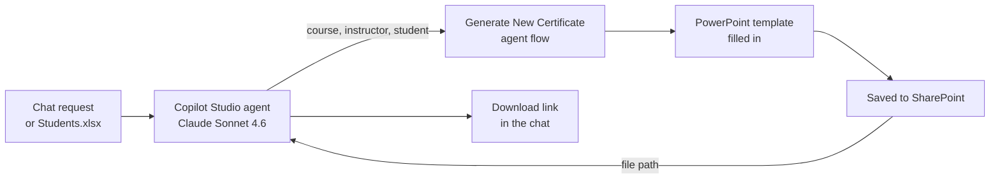

# PowerPoint Generator Agent

## 1. Project Overview

The PowerPoint Generator Agent is a conversational AI agent that creates certificates of completion as PowerPoint files. A user describes what they need in plain language, or uploads a list of students in Excel, and the agent fills in a certificate template for each person, saves the file to SharePoint and returns a download link in the chat.

* **Use case:** Generating personalized certificates of completion for course participants
* **Intended audience:** Training coordinators, academies and HR or learning teams who issue certificates
* **Main technologies:** Microsoft Copilot Studio (agent "PowerPoint Generator Agent"), Claude Sonnet 4.6 as the agent's model, an agent flow ("Generate New Certificate"), a PowerPoint template and SharePoint

## 2. Business Problem & Objectives

### Problem

Preparing certificates by hand means opening a template, typing each student's name, the course, the instructor and the date, then saving and sharing each file. For a full class this is slow and repetitive, and it is easy to make typing mistakes or miss someone.

### Objectives

* Create certificates from a simple chat request
* Produce a whole class's certificates from one uploaded list
* Use a consistent, branded template for every certificate
* Store the files in SharePoint and give the user a link to each one
* Remove manual editing of PowerPoint files

## 3. Solution

The agent's description sets out the approach: it uses an agent flow to get the PowerPoint template, feeds the inputs into a prompt action, saves the output file to SharePoint and returns the file path to the chat. Its instructions tell it to run the **Generate New Certificate** tool when a certificate of completion is requested.

The tool takes three inputs (Course Name, Instructor Name and Student Name) and returns the file's full SharePoint path.

### End-to-End Workflow

**Single certificate**

1. **Request:** The user asks in plain language, for example "Create a new certificate for Nellie Nam's successful completion of AB-730 Microsoft 365 for Business Users instructed by Dr. Julien Bashir."
2. **Extract the details:** The agent picks out the student, course and instructor from the message and passes them to the flow.
3. **Generate:** The flow fills in the template and saves the PowerPoint file to SharePoint. It completed in about 4 seconds in the demo.
4. **Return the link:** The agent confirms the details and gives a "Download Certificate" link.
5. **Result:** The downloaded file is a "Copilot Academy Certificate of Completion" showing the student's name, the course, the instructor and the completion date.

**Batch of certificates**

1. **Upload a list:** The user asks the agent to "Create a new certificate for the students" and attaches **Students.xlsx**.
2. **Run for each student:** The agent reads the list and runs the flow once per student (5 runs in the demo, for Ethan Tan, Chloe Lim, Daniel Wong, Sophia Lee and Ryan Koh).
3. **Summarize:** The agent returns a table with each student's name, course, instructor and a download link to their certificate.

## 4. Solution Architecture & Technologies

| Component | Role |
|---|---|
| **Microsoft Copilot Studio** | Platform used to build, test and publish the agent, including its description, instructions and tools |
| **Claude Sonnet 4.6** | The agent's model for understanding requests, extracting details and writing responses |
| **Agent flow** ("Generate New Certificate") | Takes the course, instructor and student names, creates the certificate and returns its file path |
| **PowerPoint template** | The certificate design (Copilot Academy branding, with placeholders for name, course, instructor and date) |
| **SharePoint** | Stores the generated certificate files and provides the download links |
| **Excel** (`Students.xlsx`) | Optional input listing the students for batch generation |

The internal steps of the agent flow are not opened in the demonstration. The template, prompt action and save-to-SharePoint steps are described in the agent's description.

## 5. Controls & Validation

* **Defined tool use:** The agent's instructions say exactly when to run the certificate tool, so requests are handled consistently
* **Structured inputs:** The flow takes three named text inputs, so every certificate uses the same fields
* **Confirmation of details:** The agent repeats the student, course and instructor in its reply, so the user can check them before sharing the file
* **Consistent template:** Every certificate is generated from the same PowerPoint design
* **Traceable output:** Each run returns a SharePoint file path, and the test pane shows every flow run with its inputs, outputs, status and duration
* **Testing before release:** The agent is tested in Copilot Studio's "Test your agent" pane, and the page shows a publish date of 9 May 2026

## 6. Business Value

* **Less manual work:** Certificates are created without opening or editing PowerPoint
* **Faster batch processing:** A whole class's certificates come from one uploaded list
* **Consistency:** Every certificate follows the same branded layout
* **Fewer errors:** Names and course details come straight from the request or the list, not retyped
* **Easy access:** Files are stored centrally in SharePoint, with direct download links

## 7. Skills Demonstrated

* Process analysis for document generation in training and learning teams
* AI agent design in Microsoft Copilot Studio
* Writing agent descriptions and instructions that control tool use
* Building an agent flow with typed inputs and outputs
* Document generation from a PowerPoint template
* SharePoint integration for file storage and sharing
* Batch processing from an uploaded Excel file
* Testing agent and flow behavior with run details

## 8. Future Enhancements

The following are **potential future enhancements**, not existing functionality:

* **Fix the tool name:** The flow is named "Generate New Cetificate", which should be corrected to "Certificate"
* **Custom completion date:** Add the date as an input instead of always using the run date
* **PDF output:** Save a PDF copy so certificates cannot be edited after they are issued
* **Email delivery:** Send each certificate directly to the student
* **Input checks:** Confirm missing or unclear details (for example, a missing instructor name) before generating
* **Wider table layout:** The batch summary table wraps text into narrow columns in the chat, so a simpler list or adaptive card would be easier to read
* **More templates:** Support other documents, such as reports or proposals, which the agent's description already mentions

---

## Final Summary

The PowerPoint Generator Agent is a Copilot Studio AI agent, powered by Claude Sonnet 4.6, that turns a chat request into finished certificates of completion. An agent flow fills a branded PowerPoint template with the student, course and instructor details, saves the file to SharePoint and returns a download link. Users can create one certificate from a sentence, or a whole class from an Excel list, with no manual PowerPoint editing.
