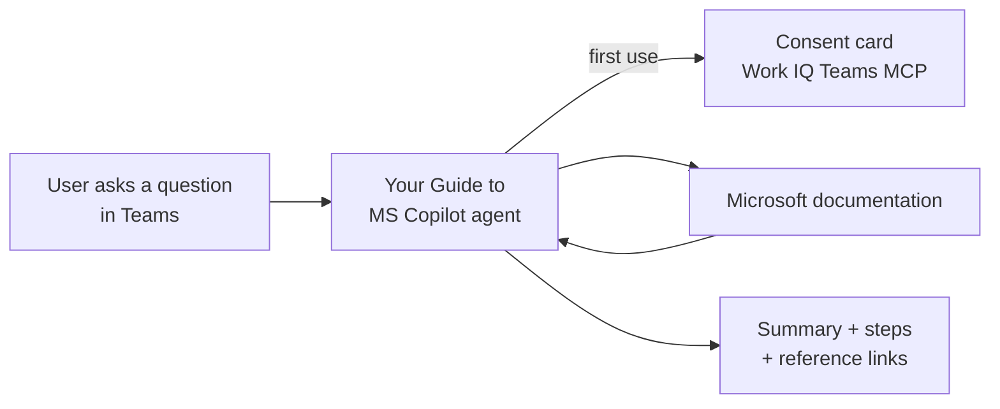

# Your Guide to MS Copilot (AI Agent)

## 1. Project Overview

Your Guide to MS Copilot is an AI agent in Microsoft Teams that helps employees learn how to use Microsoft Copilot. Users ask questions in plain language, such as how to automate email replies or what grounding means, and the agent replies with a structured answer, step-by-step guidance and links to the official Microsoft documentation it used.

* **Use case:** Self-service learning and support for Microsoft Copilot users
* **Intended audience:** Employees adopting Microsoft 365 Copilot and Copilot agents, and the IT or digital adoption teams who support them
* **Main technologies:** An AI agent used through Microsoft Teams chat, with a "Work IQ Teams MCP" connection and answers grounded in Microsoft documentation

## 2. Business Problem & Objectives

### Problem

As organizations roll out Microsoft Copilot, employees have many questions: what an agent is, how to build one, why Copilot is not responding correctly, or how to write better prompts. Answering these one by one takes time from IT and adoption teams, and searching the documentation alone can be slow and confusing for new users.

### Objectives

* Give employees one place to ask Copilot questions, inside Teams
* Guide users toward the kinds of questions the agent can answer
* Provide clear, step-by-step answers in a consistent format
* Point users to the official Microsoft documentation for each answer
* Reduce routine Copilot support requests

## 3. Solution

The agent greets the user by name and explains what it can help with, for example "What is an agent?", "How do I make an agent?" or "How do agents work?". A card of suggested question types helps users get started:

* Task-based questions
* Concept and definition questions
* Troubleshooting questions
* Build and develop guidance
* Best practices and recommendations

### End-to-End Workflow

1. **Start a chat:** The user opens the agent in Teams and sees the welcome message and suggested question types.
2. **Ask a question:** The user types a question, for example "How do I automate email replies using Copilot?"
3. **Grant access:** On first use, the agent shows a "Connect to continue" card asking permission to use the **Work IQ Teams MCP** connection with the user's credentials. The user selects Allow.
4. **Get a structured answer:** The agent replies with a summary, numbered steps and a reference section linking to Microsoft documentation, such as "Reply to emails by using Finance agents in Microsoft 365 Outlook (preview)".
5. **Continue the conversation:** The demo covers further questions across each category:
   * **Concept:** "What is grounding in Copilot?" (with how it works and its benefits)
   * **Troubleshooting:** "Why is Copilot not responding correctly?" (common error types and how to resolve them)
   * **Build guidance:** "How do I create a topic in Copilot Studio?" (seven steps, from opening Copilot Studio to publishing)
   * **Best practices:** "What are the best practices for writing Copilot prompts?" (with an example prompt structure of goal, context, expectations and source)
6. **Close politely:** Short replies such as "nice" or "great, thanks" get a brief "You're welcome."

## 4. Solution Architecture & Technologies

| Component | Role |
|---|---|
| **AI agent** ("Your Guide to MS Copilot") | Understands the question and writes a structured, referenced answer |
| **Microsoft Teams** | The chat interface, including the welcome card, suggested questions and consent prompt |
| **Work IQ Teams MCP** | A connection the agent uses with the user's credentials, approved through a consent card (shown as preview) |
| **Microsoft documentation** | The source of the answers, cited as reference links (for example Microsoft Learn and Copilot Studio documentation) |

The platform used to build the agent and its configured knowledge sources are not shown in the demonstration.

## 5. Controls & Validation

* **User consent:** Before using the Work IQ Teams MCP connection, the agent asks the user to Allow or Cancel, and explains that connecting with their credentials may carry privacy and security risks
* **Cited sources:** Each answer includes reference links to official Microsoft documentation, so users can check the information
* **AI-generated labeling:** Responses are marked "AI generated" in Teams
* **Consistent answer format:** Answers follow the same structure (summary, steps or explanation, reference and a follow-up offer)
* **Guided scope:** The welcome card steers users toward the question types the agent is designed to answer
* **Feedback:** Each response has thumbs up and thumbs down buttons for user feedback

## 6. Business Value

* **Faster adoption:** Employees get answers about Copilot when they need them, in the tool they already use
* **Less support load:** Routine "how do I" and "what is" questions are handled by the agent
* **Trustworthy answers:** Reference links let users confirm answers against Microsoft's documentation
* **Consistency:** Every user receives the same quality and format of guidance
* **Better user experience:** Suggested question types and clear, step-by-step answers make it easy for new users to start

## 7. Skills Demonstrated

* Digital adoption and change support analysis
* AI agent design for knowledge and support scenarios
* Conversation design, including welcome messages and suggested prompts
* Grounding answers in official documentation with citations
* Configuring a connection with user consent (Work IQ Teams MCP)
* Publishing and testing an agent in Microsoft Teams

## 8. Future Enhancements

The following are **potential future enhancements**, not existing functionality:

* **Check source relevance:** Some answers about Microsoft 365 Copilot cite Microsoft Security Copilot pages (the troubleshooting error list and a prompting guide using Microsoft Defender XDR examples). Limiting knowledge sources to Microsoft 365 Copilot content would keep answers on topic.
* **Explain the connection:** Tell users why the Work IQ Teams MCP connection is needed, especially when answers come from public documentation
* **Clean up the greeting:** Fix "Hello Dillon Bac. . I'm here..." and the trailing "OR" before the suggested questions
* **Organization-specific content:** Add internal guidance, such as approved agents, licensing and support contacts
* **Hand-off to support:** Offer to raise a ticket or contact the IT team when the agent cannot resolve a problem
* **Usage insights:** Track common questions and feedback to improve training materials

---

## Final Summary

Your Guide to MS Copilot is an AI agent in Microsoft Teams that helps employees learn and use Microsoft Copilot. Users ask how-to, concept, troubleshooting, build and best-practice questions in plain language, and the agent returns structured, step-by-step answers with links to official Microsoft documentation. Suggested question types and a consent-based connection make it approachable and transparent, speeding up Copilot adoption and reducing routine support requests.
