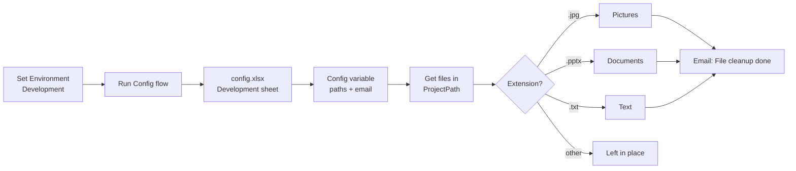

# A Reusable Configuration File

## 1. Project Overview

This project shows how to keep an automation's settings outside the automation itself. Folder paths and the notification email address are stored in an Excel configuration file, with separate settings for each environment, and loaded into the flow at runtime. To show the pattern in use, the flow sorts a folder of mixed files into Documents, Text and Pictures folders by file type, then emails a confirmation once the clean-up is done.

* **Use case:** Externalized, environment-based configuration for desktop automations, demonstrated with a folder clean-up task
* **Intended audience:** RPA developers and automation teams who build and maintain several flows across development and production
* **Main technologies:** Power Automate Desktop (main flow plus a separate "Config" desktop flow), Microsoft Excel (configuration workbook), Windows file system and Microsoft Outlook

## 2. Business Problem & Objectives

### Problem

When file paths, email addresses and other settings are typed directly into an automation, every change means editing the flow. Moving a flow from development to production, or reusing it on another machine, involves finding and updating each hard-coded value, which is slow and easy to get wrong.

### Current Process

The demo starts with a project folder that has PowerPoint, text and image files mixed together at the top level, next to the empty Documents, Text and Pictures folders they should be filed into.

### Objectives

* Keep all environment-specific settings in one place, outside the flow
* Support separate Development and Production settings without changing the flow
* Make the configuration reusable by other flows
* Show the pattern working on a practical task (sorting files by type)
* Confirm a successful run by email to an address taken from the configuration

## 3. Solution

The configuration lives in **config.xlsx**, which has a **Development** sheet and a **Production** sheet. Each sheet is a simple Key and Value list:

| Key | Purpose |
|---|---|
| ProjectPath | Folder to clean up |
| DocumentsFolderPath | Where PowerPoint files go |
| TextFolderPath | Where text files go |
| PictureFolderPath | Where image files go |
| EmailAddress | Who receives the completion email |

A separate **Config** desktop flow loads these settings, and the main flow uses them through a `Config` variable (for example, `Config['ProjectPath']`). A **template** workbook sits next to the configuration file.

### End-to-End Workflow

1. **Choose the environment:** The main flow sets the `Environment` variable to `Development`.
2. **Load the configuration:** The main flow runs the **Config** desktop flow, which provides the settings for that environment as the `Config` variable.
3. **Find the files:** The flow gets all files in `Config['ProjectPath']` and its subfolders.
4. **Sort by file type:** For each file, a switch on the file extension decides where it goes:
   * `.jpg` files move to `Config['PictureFolderPath']`
   * `.pptx` files move to `Config['DocumentsFolderPath']`
   * `.txt` files move to `Config['TextFolderPath']`
   * Any other file type is left in place (default case)
5. **Notify:** The flow launches Outlook and sends an email to `Config['EmailAddress']` with the subject "File cleanup done", then closes Outlook.
6. **Result:** The images, presentation and text files are filed into the Development folders, and the recipient gets a confirmation email.

## 4. Solution Architecture & Technologies

| Component | Role |
|---|---|
| **Power Automate Desktop: main flow** | "A Reusable Configuration File": sets the environment, loads the configuration, sorts files and sends the notification |
| **Power Automate Desktop: Config flow** | A separate desktop flow, run from the main flow, that provides the configuration values |
| **Microsoft Excel** (`config.xlsx`) | Stores Key and Value settings on separate Development and Production sheets |
| **Windows file system** | Source folder and destination folders for the sorted files |
| **Microsoft Outlook** | Sends the "File cleanup done" confirmation email |

## 5. Controls & Validation

* **Separation of configuration from logic:** Paths and the email address are read from the configuration file, not hard-coded, so settings can change without editing the flow
* **Environment separation:** Development and Production values are kept on separate sheets, and the environment is chosen with a single variable
* **Rule-based routing:** A switch on the file extension sends each supported file type to its own folder
* **Safe default:** Files with unsupported extensions are not moved
* **Run confirmation:** A completion email confirms that the flow ran and the folder was cleaned up

## 6. Business Value

* **Easier maintenance:** Settings are updated in one Excel file instead of inside each flow
* **Safer deployment:** Switching from Development to Production is a configuration choice, not a code change
* **Reusability:** The same Config flow and configuration file can serve other automations
* **Less manual work:** Mixed files are sorted into the right folders automatically
* **Visibility:** The email notification tells the team when the clean-up has finished

## 7. Skills Demonstrated

* Solution design for maintainable, reusable automations
* Externalized configuration and environment management (Development and Production)
* Power Automate Desktop development, including calling one desktop flow from another
* Working with dictionary-style variables (`Config['Key']`)
* File system automation (get files, switch on extension, move files)
* Outlook automation for run notifications

## 8. Future Enhancements

The following are **potential future enhancements**, not existing functionality:

* **Set the environment outside the flow:** Pass the environment as an input variable, so the same flow can run in Production without any edits
* **Validate the configuration:** Check that every required key exists and that each folder path is valid before processing starts
* **Error handling and alerts:** Send a failure email, not only a success email, if a move fails or a path is missing
* **More file types:** Add rules for other extensions (for example `.png`, `.docx` and `.pdf`), ideally defined in the configuration file
* **Run summary:** Include the number of files moved by type in the completion email
* **Keep the source folder only:** Search only the top level of the project folder, so files already in the destination subfolders are not picked up again

---

## Final Summary

A Reusable Configuration File shows how to keep a desktop automation's settings in one place. Folder paths and the notification email address are stored in an Excel file with separate Development and Production sheets, and a dedicated Config flow loads them at runtime. The demo flow uses these settings to sort mixed files into folders by type and email a confirmation. The approach makes automations easier to maintain, reuse and promote between environments.
