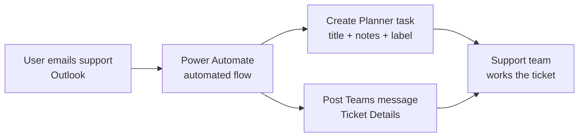

# Automated Ticket Management System

## 1. Project Overview

This project turns support emails into tracked tickets automatically. When a user emails the support mailbox about a problem, an automated flow creates a task in Microsoft Planner and posts the ticket details to Microsoft Teams, so the support team can see and act on every issue without logging it by hand.

* **Use case:** Logging and notifying support tickets for issues with business automations and apps (for example, approval workflows not triggering or an expense app failing to submit)
* **Intended audience:** An internal support or automation team that handles issue reports from business users
* **Main technologies:** Power Automate (automated cloud flow "MS Power Platform Ticket Issues Flow"), Office 365 Outlook, Microsoft Planner and Microsoft Teams

## 2. Business Problem & Objectives

### Problem

Users report problems by email, for example "Procurement Approval Email Missing", "Sales Dashboard Not Loading" or "Leave Approval Workflow Not Triggered". If these emails sit in an inbox, someone has to read each one, log it somewhere, and tell the team. Issues can be missed, and there is no shared view of what is open.

### Current Process

Issue reports arrive as individual emails in the support inbox, each with a subject line describing the problem and a short explanation in the body.

### Objectives

* Capture every support email as a ticket automatically
* Keep all tickets on one shared board
* Notify the support team in Teams as soon as a ticket is created
* Carry the key details (issue title, description, sender and priority) into the ticket and the notification

## 3. Solution

An automated Power Automate flow monitors incoming support emails. For each new issue email, it creates a task on the **MS Power Platform Ticket Issues** plan in Planner and posts a "Ticket Details" message in Teams.

### End-to-End Workflow

1. **User reports an issue:** A business user emails support with the problem in the subject line, for example "Procurement Approval Email Missing", and a description in the body.
2. **Flow is triggered:** The automated flow picks up the new email in Office 365 Outlook.
3. **Ticket is created:** The flow creates a Planner task in the **MS Power Platform Tickets** bucket. The email subject becomes the task title and the email body goes into the task notes. The new task starts as *Not started* and is tagged with a label.
4. **Team is notified:** The flow posts a message in Teams through the Workflows app: "A new task has been created in Microsoft Planner", followed by the ticket details (issue title, issue description, sender and priority) and a request to review and take action.
5. **Team acts on the ticket:** The support team picks up the task on the Planner board, where it can be assigned, prioritized and tracked to completion.

## 4. Solution Architecture & Technologies

| Component | Role |
|---|---|
| **Office 365 Outlook** | Support mailbox where issue reports arrive, and the trigger source for the flow |
| **Power Automate automated cloud flow** | "MS Power Platform Ticket Issues Flow": reads each new email and creates the ticket and notification |
| **Microsoft Planner** | "MS Power Platform Ticket Issues" plan: the ticket board, with each issue as a task |
| **Microsoft Teams (Workflows)** | Posts the ticket details message to the support team |

## 5. Controls & Validation

This is an intake and notification automation. Approval logic, input validation and exception handling are not shown in the demonstration. The controls that are demonstrated are:

* **Consistent ticket creation:** Every issue email becomes a Planner task in the same plan and bucket, with the same structure
* **Priority capture:** The email's importance appears as the priority in the Teams message (for example, "Priority: high")
* **Traceability:** The sender's email address is included in the ticket details, so the team knows who reported the issue
* **Run monitoring:** The flow's run history shows each run and its result (for example, Succeeded or Test succeeded)
* **Human-in-the-loop:** The support team reviews each ticket in Planner and decides on the next action

## 6. Business Value

* **Less manual work:** Tickets are logged automatically, with no copying of emails into a tracker
* **Faster response:** The support team is told about new issues in Teams as they arrive
* **Better visibility:** All issues sit on one Planner board, where they can be assigned and tracked
* **Consistency:** Every ticket has the same format, with title, description, sender and priority
* **Fewer missed issues:** Each email creates a ticket, so reports are less likely to be overlooked in the inbox

## 7. Skills Demonstrated

* IT support process analysis and ticket intake design
* Power Automate automated cloud flow development
* Integration across Office 365 Outlook, Microsoft Planner and Microsoft Teams
* Mapping email data (subject, body, sender, importance) into tasks and messages
* Writing clear, structured notification messages
* Testing and monitoring flows with run history

## 8. Future Enhancements

The following are **potential future enhancements**, not existing functionality:

* **Clean email content:** Strip the Outlook security banner ("You don't often get email from...", "Caution: This is an Internet email...") and keep the full description, which is currently cut short in the ticket
* **Align priority:** Set the Planner task priority from the email's importance (a high-importance email currently creates a Medium-priority task)
* **Auto-assignment:** Assign tickets to a team member based on keywords or the affected system
* **Acknowledge the requester:** Send an automatic reply with a ticket reference to the person who reported the issue
* **Duplicate detection:** Flag repeated reports of the same issue (for example, two "Leave Approval Workflow Not Triggered" emails)
* **Reporting:** Add a dashboard of open, in-progress and completed tickets by category

---

## Final Summary

An automated ticket management solution that turns support emails into tracked tickets. A Power Automate flow monitors the support mailbox, creates a Planner task for each new issue, and posts the ticket details (title, description, sender and priority) to Microsoft Teams. The support team gets instant notification and a single board to assign and track issues, which means less manual logging and fewer missed requests.
