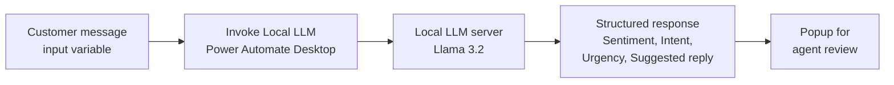

# Customer Message Triage (Local LLM)

## 1. Project Overview

This project uses a locally hosted large language model (LLM) to triage customer messages automatically. A desktop automation flow sends a customer message to the model, which classifies its sentiment, intent and urgency and drafts a short, empathetic reply. The result is shown to the user straight away, so a support agent can see how to handle the message without reading and assessing it from scratch.

* **Use case:** First-pass triage of incoming customer messages for customer support
* **Intended audience:** Customer support agents and teams that handle customer complaints, questions and requests
* **Main technologies:** Power Automate Desktop, the "Invoke Local LLM" action, and the Llama 3.2 model served from a local LLM server (`http://localhost:11434/v1`)

## 2. Business Problem & Objectives

### Problem

Support teams receive many customer messages, and each one has to be read to work out how the customer feels, what they want and how urgent it is before anyone can reply. This slows down responses, and urgent complaints can wait in the queue behind routine questions. Sending customer messages to a cloud AI service may also raise privacy concerns.

### Objectives

* Classify each customer message by sentiment, intent and urgency
* Draft a short, empathetic reply that an agent can use as a starting point
* Return results in a consistent, structured format
* Keep customer data on the local machine by using a locally hosted model
* Handle model or connection problems with a retry policy and error handling

## 3. Solution

The **Customer Message Triage (Local LLM)** flow in Power Automate Desktop has two steps: it invokes the local LLM with the customer message, then displays the model's response.

The prompt asks the model to reply in this exact format:

* **Sentiment:** Positive, Negative or Neutral
* **Intent:** Complaint, Question, Praise, Refund Request or Other
* **Urgency:** Low, Medium or High
* **Suggested reply:** A short, empathetic draft response of 2 to 3 sentences

A system prompt sets the model's role as a customer support triage assistant and tells it to be concise and always follow the requested format.

### End-to-End Workflow

1. **Provide the message:** The customer message is passed into the flow as an input variable (`customer_message`).
2. **Build the prompt:** The flow inserts the message into a structured user prompt, alongside the system prompt.
3. **Invoke the local model:** The "Invoke Local LLM" action sends the prompt to the Llama 3.2 model on the local LLM server.
4. **Capture the output:** The model's answer is stored in the `Response` variable, with token counts stored in `PromptTokens` and `CompletionTokens`.
5. **Show the result:** A popup titled "Reply : Customer Message Triage (Local LLM)" displays the triage. In the demo, a message about a delayed order before a planned trip is classified as **Sentiment: Negative**, **Intent: Complaint**, **Urgency: High**, with a suggested reply that apologizes for the delay and confirms the team is looking into it.
6. **Agent review:** The agent reads the result and confirms or dismisses it with the OK or Cancel button. The choice is stored in a variable.

## 4. Solution Architecture & Technologies

| Component | Role |
|---|---|
| **Power Automate Desktop** | Runs the "Customer Message Triage (Local LLM)" flow on the user's machine |
| **Invoke Local LLM action** | Sends the system and user prompts to a local LLM server and returns the generated response and token counts |
| **Local LLM server** (`http://localhost:11434/v1`) | Hosts the model locally, so messages are processed on the machine rather than sent to a cloud service |
| **Llama 3.2 model** (`llama3.2:latest`) | Analyzes the message and produces the sentiment, intent, urgency and suggested reply |
| **Prompt design** | A system prompt defines the assistant's role, and a structured user prompt sets the exact output format |
| **Display message action** | Shows the triage result in a popup for the agent to review |

## 5. Controls & Validation

* **Structured output:** The prompt defines fixed categories for sentiment, intent and urgency, which keeps results consistent and easy to act on
* **Guardrails through the system prompt:** The model is told to act as a triage assistant, be concise and always follow the requested format
* **Retry policy:** The LLM action is set to retry on failure, with a fixed policy of 2 retries at an interval of 3
* **Error handling:** The action's error handling settings cover connection errors, model not found, request timeouts and invalid responses
* **Human-in-the-loop:** The suggested reply is a draft. The agent reviews it and confirms or cancels before taking any action.
* **Local processing:** Messages are sent to a model on the local machine, which keeps customer data off external AI services

## 6. Business Value

* **Faster triage:** Each message is classified and given a draft reply in seconds
* **Better prioritization:** Urgency and intent labels help agents deal with high-urgency complaints first
* **Consistency:** Every message is assessed against the same categories and output format
* **Less manual effort:** Agents start from a suggested reply instead of writing every response from scratch
* **Data privacy:** A locally hosted model keeps customer messages on the machine
* **Low running cost:** The model runs locally, with no cloud AI service involved in the flow

## 7. Skills Demonstrated

* Customer support process analysis and triage design
* Desktop automation with Power Automate Desktop
* Integrating a locally hosted LLM into an automation flow
* Prompt engineering with system prompts and structured output formats
* Using variables for flow inputs, outputs and token tracking
* Configuring retry policies and error handling for AI actions
* Designing human-in-the-loop review for AI-generated content

## 8. Future Enhancements

The following are **potential future enhancements**, not existing functionality:

* **Batch processing:** Read messages from an inbox, spreadsheet or ticketing system and triage them in bulk
* **Parse the output:** Split the response into separate sentiment, intent, urgency and reply fields for use in later steps
* **Routing rules:** Send high-urgency complaints or refund requests to a specific team or queue automatically
* **Logging:** Save each message, its classification and the agent's decision to a file or database for reporting
* **Output validation:** Check that the response matches the expected format and categories, and retry if it does not
* **Send replies:** Let the agent edit and send the approved reply directly from the flow

---

## Final Summary

Customer Message Triage uses Power Automate Desktop and a locally hosted Llama 3.2 model to assess customer messages automatically. Each message is classified by sentiment, intent and urgency, and the model drafts a short, empathetic reply for the agent to review. A structured prompt, retry policy and error handling keep results consistent and reliable, while local processing keeps customer data on the machine. Agents can prioritize urgent issues and respond faster.
