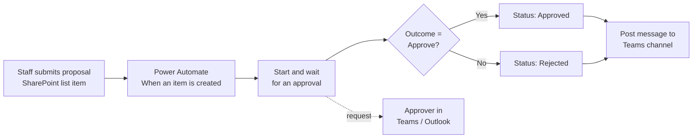

# Event Proposal Approval & Notification

## 1. Project Overview

This project automates the review of event and activity proposals for **Pedal Paradise**, a cycling business with its own SharePoint team site. Staff submit a proposal as an item in a SharePoint list. This starts an approval workflow that sends the request to an approver in Microsoft Teams and Outlook, records the decision against the proposal, and posts a notification to a Teams channel.

* **Use case:** Approving proposed events and activities such as workshops, group rides, safety days and cycling challenges
* **Intended audience:** Staff who plan events, and the manager or coordinator who approves them
* **Main technologies:** Microsoft SharePoint Online, Power Automate (cloud flow with Approvals), Microsoft Teams and Outlook

## 2. Business Problem & Objectives

### Problem

Event proposals involve budget, venue, participant numbers and sometimes external speakers, so they need a decision before going ahead. Without a defined process, proposals tend to be sent by email or chat, decisions are hard to trace, and the team may not know which events have been approved.

### Objectives

* Capture every proposal in one structured register with consistent fields
* Send each new proposal to an approver automatically
* Let the approver decide quickly from Teams or email, with the full details in front of them
* Record the approval status against each proposal
* Keep the team informed through a shared Teams channel

## 3. Solution

The **Event Activities** list on the Pedal Paradise SharePoint site works as the proposal register. It holds event name, event date, venue, participants, external speaker, budget, proposal reference, submitter, approval status and approver comments, and supporting documents can be attached. A Power Automate flow watches the list and handles the approval from start to finish.

### End-to-End Workflow

1. **Submit:** A staff member creates a new item in the Event Activities list, fills in the event details and attaches the proposal document (for example, a Cycling Safety Inspection Day guide in PDF). The approval status starts as *Pending*.
2. **Trigger:** The flow starts automatically when the item is created.
3. **Request approval:** The flow sends an Approve/Reject request titled "Do you want to approve this proposal?". The request includes the event name, budget, event date, submitter and a link back to the SharePoint item.
4. **Review:** The approver sees the request in the Teams Approvals app and in Outlook. They can open the item, add comments and approve or reject.
5. **Evaluate outcome:** A condition step checks whether the outcome equals *Approve* and follows the matching branch.
6. **Record decision:** The proposal's Approval Status in SharePoint changes from *Pending* to *Approved* (or *Rejected*), so the register always shows the current state.
7. **Notify:** The flow posts a message with the proposal details (event, date, venue, participants, proposal document and budget) to the team's Teams channel. The requester also receives a final status notification by email and in Teams.

## 4. Solution Architecture & Technologies

| Component | Role |
|---|---|
| **SharePoint Online (Event Activities list)** | Proposal register and data store. Typed columns cover number, currency, yes/no, person and choice fields, plus attachments for proposal documents. |
| **SharePoint site page** | Pedal Paradise team site with news, event listings and a route map, giving context for the events being proposed |
| **Power Automate cloud flow** | "New Event Activities Flow": the trigger, approval, condition and notification logic |
| **Power Automate Approvals** | Sends the Approve/Reject request, waits for a response and returns the outcome, approver, timestamps and comments |
| **Microsoft Teams** | Approvals app for reviewing and responding, and a team channel for workflow notifications |
| **Outlook** | Approval request and final status emails |

## 5. Controls & Validation

* **Structured data entry:** The list uses typed fields (number for participants, currency for budget, yes/no for external speaker, person picker for submitter), so proposals come in a consistent format
* **Default status:** New proposals start as *Pending*, so nothing counts as approved until a decision is made
* **Approval logic:** An Approve/Reject approval (first to respond) is required before the proposal status changes
* **Business rule on outcome:** A condition checks the approval outcome and routes the flow to the approved or rejected path
* **Human-in-the-loop:** A named approver reviews each proposal with its details and a link to the source item, and can add comments
* **Audit trail:** Approval history in Teams shows each request with its status and date. Flow run history records the approver, response, request and response timestamps, and outcome for every run.
* **Status visibility:** The list shows Approved, Rejected and Pending status labels, so the register shows the outcome of every proposal

## 6. Business Value

* **Less manual work:** Approval requests and notifications go out automatically when a proposal is submitted
* **Faster decisions:** Approvers can respond straight from Teams or email, without searching for the proposal
* **Better visibility:** Every proposal and its status sits in one list, and the team channel gets updates on submissions
* **Consistency:** Every proposal collects the same information and goes through the same approval steps
* **Accountability:** Decisions are tied to a named approver with timestamps and can be traced back later

## 7. Skills Demonstrated

* Business process analysis and workflow design for approvals
* SharePoint list design with appropriate column types and a status lifecycle
* Power Automate cloud flow development (SharePoint trigger, Approvals, conditions, Teams actions)
* Using dynamic content to build approval requests and notifications from list data
* Microsoft 365 integration across SharePoint, Teams and Outlook
* Testing and validating flows using run history and approval outputs

## 8. Future Enhancements

The following are **potential future enhancements**, not existing functionality:

* **Budget-based routing:** Send higher-budget proposals or those with external speakers to an additional approver
* **Richer notifications:** Include the decision and approver comments in the Teams message, and clean up the wording (for example, "has submitted" in place of "has subitted")
* **Write back comments:** Save the approver's comments to the Approver Comments column automatically
* **Validation rules:** Make key fields such as event date, venue and budget required, and block event dates in the past
* **Duplicate check:** Warn when a proposal with the same event name and date already exists
* **Reporting:** Add a view or dashboard showing proposals by status, month and total approved budget

---

## Summary

An automated approval workflow for event proposals at Pedal Paradise, a cycling business. Staff submit proposals with budget, venue, participants and supporting documents to a SharePoint list. A Power Automate flow sends each proposal to an approver in Teams and Outlook, evaluates the decision, updates the proposal status and posts a notification to the team channel. The solution replaces informal requests with a consistent, traceable approval process.
