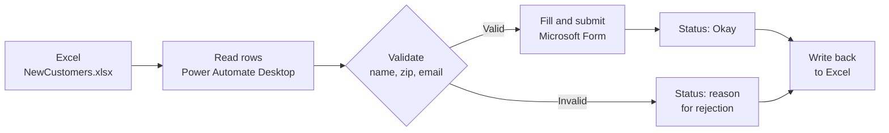

# Input Validation (RPA Data Entry)

## 1. Project Overview

This project is a desktop automation (RPA) bot that checks customer records before entering them into an online form. It reads new customer details from an Excel workbook, validates each record's name, zip code and email address against defined rules, and submits only the valid records to a "Create new customer" Microsoft Form. Each record's outcome is written back to Excel, either "Okay" or a clear reason why it failed.

* **Use case:** Validating and entering new customer records from a spreadsheet into a web form
* **Intended audience:** Operations or administrative teams responsible for customer data entry
* **Main technologies:** Power Automate Desktop (flow "Input Validation" with subflows), Microsoft Excel, Microsoft Edge browser automation and Microsoft Forms

## 2. Business Problem & Objectives

### Problem

Customer data collected in spreadsheets often contains errors, such as zip codes written as text ("Don't know my zip code"), missing first or last names, or invalid email addresses. If this data is typed into a system as it is, the errors flow straight into the customer records. Checking every row by hand before entering it is slow and easy to get wrong.

### Current Process

New customer details (name, zip code and email) are kept in an Excel workbook, **NewCustomers.xlsx**, with a blank Status column, and need to be entered into the "Create new customer" form one by one.

### Objectives

* Validate every customer record before it is entered
* Enter only valid records into the customer form
* Record a clear, specific reason for every rejected record
* Make the browser step reliable, so the bot can recover if the form is slow to load
* Keep the solution easy to maintain by splitting the logic into reusable subflows

## 3. Solution

The **Input Validation** flow in Power Automate Desktop is organized into a main flow and separate subflows for launching the form, validating each field and entering the data (for example, `CustomerForm_LaunchAndLogin`, `Validation_ZipCode`, `Validation_Email`, `Validation_Name` and a form input subflow).

### End-to-End Workflow

1. **Initialize:** The flow sets the form URL and project path, opens **NewCustomers.xlsx** in Excel, activates the "Information" worksheet and reads all customer rows into a data table.
2. **Launch the form:** The bot closes any "Create new customer" browser tab that is already open, then opens the Microsoft Form in Microsoft Edge. It checks that the page has loaded by looking for the "Start now" button. If the page has not loaded, it waits 5 seconds and tries again, up to 3 times.
3. **Loop through customers:** For each row, the bot reads the name, zip code and email into variables.
4. **Validate the record:** Each field is checked against the validation rules (see Controls & Validation).
5. **Enter valid records:** If all checks pass, the bot starts the form, fills in Full name, Zip code and Email address, and submits it.
6. **Write the result:** The bot writes the outcome to the Status column in Excel. Valid records are marked "Okay". Invalid records are skipped and get a specific message, such as "The zip code started with 0" or "The email address contained more than one '@'".
7. **Review:** Once the run finishes, the workbook shows which records were entered and why the others were rejected. In the demo, 4 of the 10 records were valid and submitted, and 6 were flagged with reasons.

## 4. Solution Architecture & Technologies

| Component | Role |
|---|---|
| **Power Automate Desktop** | Runs the "Input Validation" flow, including the main loop, validation logic and subflows |
| **Microsoft Excel** (`NewCustomers.xlsx`) | Source of customer records, and where each record's Status is written |
| **Microsoft Edge browser automation** | Opens the form, checks the page has loaded, fills in fields and submits responses |
| **Microsoft Forms** ("Create new customer") | Target form where valid customer records are entered |
| **Subflows** | Separate the launch, validation and input logic into reusable, easier-to-maintain parts |

## 5. Controls & Validation

**Validation rules** (taken from the status messages produced in the demo)

* **Zip code:** Must be numeric, must be exactly 4 characters, and must not start with 0
* **Email address:** Must contain only one "@", and must contain a "." after the "@"
* **Name:** Must contain a space, so both a first and a last name are given

**Process controls**

* **Validate before entry:** Only records that pass every check are entered into the form, so bad data is stopped at the source
* **Specific error messages:** Each rejected record gets a clear reason in Excel, which makes it quick to correct
* **Retry logic:** The bot retries loading the form up to 3 times, waiting 5 seconds between attempts, and checks for the "Start now" button before continuing
* **Clean start:** Any existing "Create new customer" tab is closed before a new session starts, to avoid conflicts
* **Audit trail:** The Status column gives a record of what happened to every row in the run
* **Human-in-the-loop:** Staff review the flagged records, fix the data and re-run the bot if needed

## 6. Business Value

* **Better data quality:** Invalid zip codes, names and email addresses are caught before they reach the customer records
* **Less manual work:** Valid records are entered automatically, with no retyping
* **Faster correction:** Clear rejection reasons show exactly what needs fixing in each row
* **Consistency:** The same rules are applied to every record, every time
* **Reliability:** Retry logic and page checks make the browser automation less likely to fail part way through
* **Maintainability:** Separate subflows make it easier to update a single rule or step

## 7. Skills Demonstrated

* Data quality analysis and business rule definition
* RPA development with Power Automate Desktop
* Excel automation (open workbook, read table, write results)
* Web browser automation (launch, page checks, form filling and submission)
* Input validation logic for text, numeric and email fields
* Retry and resilience patterns for UI automation
* Modular flow design using subflows and variables
* Testing with realistic valid and invalid data

## 8. Future Enhancements

The following are **potential future enhancements**, not existing functionality:

* **Stronger email validation:** Use a single pattern check (regular expression) to cover more invalid email formats
* **Handle retry failure:** Notify the user or log an error clearly if the form still fails to load after 3 attempts
* **Run summary:** Send a short email or report at the end with counts of submitted and rejected records
* **Duplicate check:** Skip customers who have already been submitted, so the bot can be re-run safely
* **Colour-coded results:** Highlight "Okay" and rejected rows in Excel to make review faster
* **Configurable rules:** Store the validation rules (such as zip code length) in a settings file so they can change without editing the flow

---

## Final Summary

Input Validation is a Power Automate Desktop bot that checks customer records before entering them into a web form. It reads names, zip codes and email addresses from Excel, applies clear validation rules, and submits only valid records to a Microsoft Form through browser automation. Each row gets an "Okay" or a specific rejection reason in Excel, and retry logic keeps the process reliable. The result is cleaner data and less manual checking.
