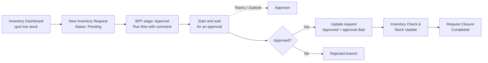

# Kiddy Lah! Inventory Management System

## 1. Project Overview

This project is an inventory management application for **Kiddy Lah! Toy Shop**. It brings stock records, stock monitoring dashboards and a guided restock request process together in one app. When staff need more stock of an item, they raise a request that moves through defined stages, and an approval flow sends the request to an approver in Microsoft Teams and Outlook before the request is closed.

* **Use case:** Monitoring toy inventory levels and managing inventory requests with approval
* **Intended audience:** Toy shop staff who manage stock, and the manager who approves inventory requests
* **Main technologies:** Power Apps (model-driven app), Microsoft Dataverse, Business Process Flow, Power Automate (instant flow with Approvals), Microsoft Teams and Outlook

## 2. Business Problem & Objectives

### Problem

A toy shop carries many products across categories such as LEGO playsets, board games, learning toys, soft toys and racing toys. Without a central system, it is hard to see which items are running low or out of stock, and requests for more stock are often made informally, with no clear approval or record.

### Objectives

* Keep a single, structured record of every inventory item
* Show stock levels and stock status clearly through dashboards
* Give staff a consistent, step-by-step process for raising inventory requests
* Require manager approval before a request is completed
* Record each request's status, approver and approval date against the inventory item

## 3. Solution

The **Inventory Management System App** opens on a Kiddy Lah! welcome page that shows the shop's mission, and gives access to dashboards, inventory records and inventory requests.

* **Inventory records** hold item name, price, initial and current quantity, items sold, description, supplier, category, stock status (In Stock, Low on Stock, Out of Stock) and asset number.
* **Inventory Dashboard** shows current stock by category, a stock status overview, the top 5 items with the highest stock, and inventory count by category.
* **Inventory Requests** use a business process flow called **Inventory Request Process** that guides staff through four stages: Request, Approval, Inventory Check & Stock Update, and Request Closure.
* **Inventory Request Dashboard** summarizes request status by inventory item and the distribution of request reasons.

### End-to-End Workflow

1. **Monitor stock:** Staff review the dashboards and inventory views to spot low or out-of-stock items. Selecting a segment of a chart filters the list, for example to show only the items that are low on stock.
2. **Raise a request:** Staff create a new inventory request and select the inventory item. The item's details (description, supplier, current quantity, initial quantity, items sold, price) appear on the form automatically. Staff then enter the quantity needed, request date, request reason and remarks. The request status starts as *Pending*.
3. **Request approval:** At the Approval stage, staff run the **BPF Request Inventory Workflow** directly from the process stage and add a required comment.
4. **Approve or reject:** The flow sends an "Inventory Item Request" approval with a link to the request record. The approver responds in the Teams Approvals app or straight from the Outlook email, with comments.
5. **Update the record:** A condition checks the outcome. When the request is approved, the flow updates the request in Dataverse with an *Approved* status and the approval date. A separate branch handles a rejected outcome.
6. **Check and close:** Staff move through the Inventory Check & Stock Update stage and finish the Request Closure stage, which marks the process as completed.
7. **Track:** The approved request appears in the inventory item's related requests list and in the Inventory Request Dashboard.

## 4. Solution Architecture & Technologies

| Component | Role |
|---|---|
| **Power Apps model-driven app** | "Inventory Management System App": navigation, welcome page, forms, views and dashboards |
| **Microsoft Dataverse** | Stores the Inventory and Inventory Requests tables, with a lookup linking each request to an inventory item |
| **Business Process Flow** | "Inventory Request Process": guides each request through the Request, Approval, Inventory Check & Stock Update, and Request Closure stages |
| **Power Automate instant flow** | "BPF Request Inventory Workflow": run from the process stage to start the approval, evaluate the outcome and update the request record |
| **Power Automate Approvals** | Sends the approval request and returns the outcome, approver, comments and response time |
| **Microsoft Teams and Outlook** | Where the approver reviews and responds to the request, including actionable Approve/Reject buttons in the email |
| **Dashboards and charts** | Visualize stock levels, stock status and request activity, with charts that filter the related records |

## 5. Controls & Validation

* **Required fields:** Key fields such as item name, quantities, category, stock status, inventory, quantity needed, request date, request reason, approver, approval date and request status are marked as required
* **Data integrity through lookups:** Each request is linked to an existing inventory record, and that item's details are shown read-only on the request form so they cannot be changed from the request
* **Calculated values:** Fields such as Items Sold and Total Quantity Requested are system-managed (locked) rather than entered by hand
* **Default status:** New requests start as *Pending* until a decision is recorded
* **Guided process:** The business process flow makes staff complete each stage in order, with stage-level fields to confirm before moving on
* **Approval gate and human-in-the-loop:** A manager must approve or reject each request, and a comment is required when the approval flow is started
* **Decision logic:** A condition in the flow routes approved and rejected outcomes to separate update steps
* **Audit trail:** The approval history in Teams, the flow run history, and the approval date and status stored on each request show who approved what, and when

## 6. Business Value

* **Better visibility:** Dashboards show stock levels, low-stock items and request activity at a glance
* **Consistency:** Every inventory request follows the same stages and collects the same information
* **Faster approvals:** Approvers can respond from Teams or straight from the email, without opening the app
* **Fewer errors:** Lookups and calculated fields cut down on retyping and manual mistakes
* **Accountability:** Each request records its approver, approval date and status, linked to the inventory item
* **Better user experience:** A welcome page and a guided process make the app approachable for shop staff

## 7. Skills Demonstrated

* Business process analysis for inventory control and stock requests
* Dataverse data modeling with related tables, lookups, choice fields and calculated fields
* Model-driven app design with custom forms, views and a welcome page
* Business process flow design with sequential stages
* Power Automate instant flow development (flow step trigger, Approvals, conditions, Dataverse updates)
* Dashboard and chart design for operational reporting
* Microsoft 365 integration with Teams and Outlook approvals
* Testing end-to-end scenarios and checking results in run history

## 8. Future Enhancements

The following are **potential future enhancements**, not existing functionality:

* **Automatic stock update:** Increase the item's current quantity and refresh its stock status automatically when an approved request is received
* **Low-stock alerts:** Notify staff in Teams or by email when an item drops to Low on Stock or Out of Stock
* **Approver routing:** Route requests to a named manager, or to a different approver for larger quantities
* **Rejection feedback:** Save the approver's comments to the request and notify the requester of the outcome
* **Supplier ordering:** Generate a purchase request for the item's supplier from an approved request
* **Role-based security:** Separate permissions for staff and managers using Dataverse security roles

---

## Portfolio Summary

An inventory management system for Kiddy Lah! Toy Shop, built as a Power Apps model-driven app on Microsoft Dataverse. Dashboards highlight stock levels and low-stock items, while a business process flow guides staff through raising, approving and closing inventory requests. A Power Automate approval flow sends each request to a manager in Teams or Outlook and records the outcome. The result is clear stock visibility and a consistent, traceable request process.
