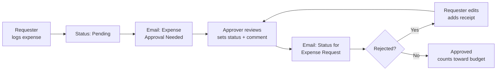

# My Budgee Expense Tracker

## 1. Project Overview

My Budgee Expense Tracker is a mobile-style app for submitting, approving and tracking expenses against a budget. Requesters log expenses with receipts, an approver reviews and approves or rejects them, and both sides see how spending compares to the set budget. Email notifications keep each person informed when an expense needs review or its status changes.

* **Use case:** Expense submission, approval and budget tracking
* **Intended audience:** Staff who submit expenses (requesters) and the person who approves them and sets the budget (approver)
* **Main technologies:** Power Apps (canvas app with a phone layout), with automated email notifications sent through the Power Apps and Power Automate notification service

## 2. Business Problem & Objectives

### Problem

When expenses are claimed by email or on paper, it is hard to know what has been spent, what is still waiting for approval, and how much budget is left. Approvers have to chase missing receipts, requesters do not know where their claim stands, and nobody has a running view of spending by category or month.

### Objectives

* Give requesters a simple way to log expenses and attach receipts
* Route each expense to an approver and record the decision with comments
* Notify the right person when an expense is submitted or its status changes
* Show total spending against the budget, with the remaining amount
* Let the approver set and update the budget
* Provide simple reports of spending by category and by month

## 3. Solution

The app opens on a home screen with three entry points: **Submit Expense**, **Track My Expense** and **Approval**. Each role sees its own screens and navigation.

**Requester screens**

* **Log New Expense:** Date, category, amount, description and file upload. The requester's name and the assigned approver fill in automatically.
* **View Past Expenses:** A list of submitted expenses with status filters (Pending, Approved, Rejected), sorting by date, a running total and a record count. Each item can be edited or deleted.
* **Edit Submitted Expense:** Update an expense and add attachments, for example a receipt the approver asked for.
* **My Budget Tracking:** A pie chart of spending by category and a bar chart of total spend by month.

**Approver screens**

* **Approval Expense Reporting:** A list of expenses with the same filters and sorting.
* **Approval Details:** Requester information, attachments, a status choice (Pending, Approved, Rejected), comments and an approval history log.
* **Settings Management:** Set the budget amount.

Every screen shows a **Total Expense** banner with the amount spent, the budget and the remaining amount.

### End-to-End Workflow

1. **Submit:** The requester logs an expense (for example, a $210 team dinner) and submits it. The expense is saved with a *Pending* status.
2. **Notify the approver:** The approver receives an "Expense Approval Needed" email with the requester's name, asking them to review it in the app.
3. **Review:** The approver opens the expense, checks the details and attachments, sets the status and adds a comment. In the demo, the first decision is *Rejected* with the comment "Receipt needed".
4. **Notify the requester:** The requester receives a "Status for Expense Request" email saying the status has been updated.
5. **Resubmit:** The requester filters for rejected expenses, opens the item, attaches the receipt and updates it.
6. **Re-review:** The approver reviews the updated expense and changes the status to *Approved* with the comment "All good. Approved!". The requester is notified again.
7. **Track spending:** Both roles can see approved expenses, totals against the budget, and charts by category and month.
8. **Manage the budget:** The approver updates the budget (for example, from $2,000 to $1,500). The new amount shows straight away on the requester's screens.

## 4. Solution Architecture & Technologies

| Component | Role |
|---|---|
| **Power Apps canvas app** | Mobile-style interface with separate requester and approver screens, forms, galleries, filters and navigation |
| **Expense records** | Store each expense with date, category, amount, description, requester, approver, status, comments, attachments and approval history |
| **Budget setting** | Stores the budget amount used to calculate the remaining amount |
| **Email notifications** | "Expense Approval Needed" to the approver and "Status for Expense Request" to the requester, sent from the Power Apps and Power Automate notification service |
| **Charts** | Spending by category (pie) and total spend by month (bar) |

The underlying data source is not shown in the demonstration.

## 5. Controls & Validation

* **Required fields:** Category and amount are required. The Submit button stays disabled and shows "Category is required" and "Amount is required" until both are filled in.
* **Pre-filled identity:** The requester's name and the assigned approver are filled in automatically, so they are not typed by hand.
* **Approval workflow:** Every expense starts as *Pending* and needs an approver decision (Approved or Rejected).
* **Human-in-the-loop with feedback:** Approvers add comments to explain decisions, such as asking for a missing receipt.
* **Audit trail:** Each expense keeps a timestamped approval history (for example, "Approval assigned to Jack Black, Requested By BAC SAY RON").
* **Delete confirmation:** Deleting an expense asks for confirmation and warns that the action cannot be undone.
* **Role-based screens:** Requesters and approvers see different screens and navigation, and only the approver screens include status updates and budget settings.
* **User feedback:** Confirmation messages such as "Submitted Successfully" and "Budget saved successfully!" show that an action has completed.

## 6. Business Value

* **Less manual follow-up:** Email notifications tell approvers and requesters when action is needed
* **Faster resolution:** Rejected expenses come back with a clear reason and can be fixed and resubmitted in the app
* **Better visibility:** Totals, remaining budget and charts show spending at a glance
* **Budget control:** The approver can adjust the budget, and everyone sees the effect straight away
* **Accountability:** Status, comments and approval history are recorded against every expense
* **Better user experience:** A simple, mobile-friendly layout makes logging expenses quick

## 7. Skills Demonstrated

* Business process analysis for expense claims and approvals
* Power Apps canvas app design with a mobile layout and role-based navigation
* Form design with validation, attachments and pre-filled user details
* Gallery design with filtering, sorting, totals, edit and delete actions
* Approval status logic with comments and an approval history log
* Automated email notifications for approval and status updates
* Budget calculations and simple data visualization (pie and bar charts)
* Testing end-to-end scenarios, including a reject and resubmit cycle

## 8. Future Enhancements

The following are **potential future enhancements**, not existing functionality:

* **Richer notifications:** Include the expense amount, category, decision and comments in the email, with a direct link to the record
* **Budget alerts:** Warn requesters and the approver when spending gets close to or exceeds the budget
* **Receipt rules:** Require a receipt for expenses above a set amount before they can be submitted
* **Multi-level approval:** Route higher-value expenses to a second approver
* **Restrict editing:** Lock approved expenses so they cannot be changed or deleted without approval
* **Export:** Allow monthly expense reports to be exported for finance

---

## Summary

My Budgee Expense Tracker is a mobile-style Power Apps app that brings expense claims, approvals and budget tracking together. Requesters log expenses with receipts and track their status, while an approver reviews each claim, records a decision with comments and sets the budget. Email notifications flag new submissions and status changes, and charts show spending by category and month. The app replaces informal claims with a clear, traceable process.
