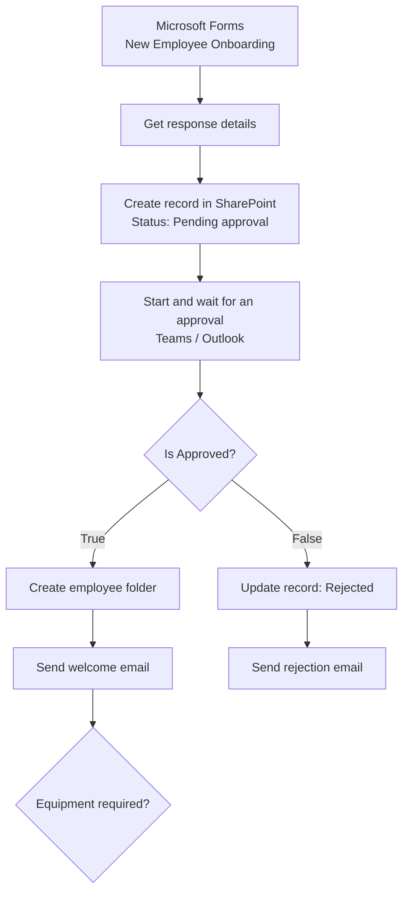

# New Employee Onboarding Automation

## 1. Project Overview

This project automates the first stage of onboarding a new hire. Details about the new employee are captured through an online form. An onboarding record is created automatically in SharePoint, and the request goes to an approver. Depending on the decision, the workflow either starts onboarding tasks and welcomes the employee, or marks the request as rejected and sends a rejection notice.

* **Use case:** Capturing and approving new employee onboarding requests
* **Intended audience:** HR teams, hiring managers and onboarding coordinators
* **Main technologies:** Microsoft Forms, Power Automate (cloud flow with Approvals), SharePoint Online, Microsoft Teams and Outlook

## 2. Business Problem & Objectives

### Problem

Onboarding a new hire involves collecting personal and job details, getting the hire confirmed, setting up a place for their documents, and sending a welcome message. When this is handled through scattered emails and manual data entry, details get retyped, steps get missed, and it is hard to see where each new hire is in the process.

### Objectives

* Collect new employee details in a consistent, structured format
* Create an onboarding record automatically, without manual data entry
* Require approval before onboarding begins
* Start the right follow-up actions based on the approval decision
* Keep a central record of each new hire with their status and the approver's comments

## 3. Solution

A Microsoft Forms questionnaire, **New Employee Onboarding**, collects the employee's name, personal email, job title, department, start date, employment type, whether equipment is required, and additional notes. Each submission starts a Power Automate flow called **Create Onboarding Record**, which writes the data to a SharePoint list and manages the approval.

### End-to-End Workflow

1. **Submit details:** The new employee's information is entered in the onboarding form and submitted.
2. **Capture response:** The flow is triggered by the new form response and retrieves the full response details.
3. **Create record:** A new item is created in the **New Employee Onboarding** SharePoint list with an Employee Status of *Pending approval*.
4. **Request approval:** An approval request (for example, "Maria Garcia is joining us on 2026-10-01. Please approve the onboarding process to start.") is sent to the approver through the Teams Approvals app and Outlook.
5. **Decide:** The approver approves or rejects the request and can add comments.
6. **Approved path:**
   * The employee's status is updated to an onboarding stage and the approver's comments are saved to the record
   * An employee folder is created in SharePoint
   * A welcome email is sent to the new employee's personal email address
   * An **Equipment** condition then checks the equipment answer from the form
7. **Rejected path:**
   * The onboarding record is updated to *Rejected* and the approver's reason is saved to the record
   * An "Onboarding Rejected" email is sent with the outcome

## 4. Solution Architecture & Technologies

| Component | Role |
|---|---|
| **Microsoft Forms** | Intake form with required fields, choice options and a date picker for collecting new hire details |
| **Power Automate cloud flow** | "Create Onboarding Record": orchestrates the trigger, record creation, approval, decision logic and follow-up actions |
| **Power Automate Approvals** | Sends the approval request, waits for a response and returns the outcome and comments |
| **SharePoint Online** | Stores the "New Employee Onboarding" list (record, status and approval comments) and hosts the employee folders created on approval |
| **Microsoft Teams** | Approvals app where the approver reviews and responds to requests |
| **Outlook** | Sends approval request emails, the welcome email and the rejection notice |

## 5. Controls & Validation

* **Required fields:** Every core form question (name, personal email, job title, department, start date, employment type, equipment required) is mandatory
* **Input validation:** The personal email field accepts only email-format answers, the start date uses a date picker with a set date format, and department, employment type and equipment use fixed choices
* **Approval gate:** No onboarding actions run until an approver responds
* **Decision logic:** An "Is Approved" condition sends the flow down separate approved and rejected paths
* **Human-in-the-loop:** The approver reviews each request and can add comments, such as an equipment request or a reason for rejection
* **Status tracking and audit trail:** Each record moves from *Pending approval* to an onboarding or *Rejected* status, with the approver's comments stored on the record. Teams keeps the approval history, and Power Automate run history confirms each step completed successfully.

## 6. Business Value

* **Less manual work:** Form data flows straight into SharePoint, with no retyping of employee details
* **Faster onboarding start:** Approval, folder setup and the welcome email happen automatically once a decision is made
* **Consistency:** Every new hire is captured with the same fields and goes through the same approval steps
* **Better visibility:** HR can see all new hires, their status and the approver's comments in one list
* **Accountability:** Decisions and comments are recorded and can be traced back later

## 7. Skills Demonstrated

* HR process analysis and onboarding workflow design
* Form design with required fields, validation and structured choices in Microsoft Forms
* Power Automate cloud flow development (Forms trigger, SharePoint actions, Approvals, conditions, loops, email)
* SharePoint list design for status tracking and record keeping
* Conditional branching for approved and rejected outcomes
* Microsoft 365 integration across Forms, SharePoint, Teams and Outlook
* Testing approved and rejected scenarios and checking results in run history

## 8. Future Enhancements

The following are **potential future enhancements**, not existing functionality:

* **Equipment requests:** Expand the equipment step to create a request for IT automatically, with a confirmation back to HR
* **Pre-start reminders:** Send scheduled reminders to the employee and manager before the start date
* **Onboarding checklist:** Generate a task list (accounts, training, induction) for each approved hire, with owners and due dates
* **Notify HR:** Post approved and rejected outcomes to an HR Teams channel
* **Data protection:** Restrict list and folder permissions to HR, and add a privacy statement to the form, since it collects personal information
* **Reporting:** Add a view or dashboard of upcoming starters by department and status

---

## Summary

An automated onboarding workflow that turns a Microsoft Forms submission into a tracked SharePoint record and an approval request. Power Automate routes each new hire to an approver in Teams and Outlook. On approval, it creates an employee folder, sends a welcome email and checks equipment needs. On rejection, it updates the record and sends a notice. The solution gives HR a consistent, traceable starting point for every new hire.
