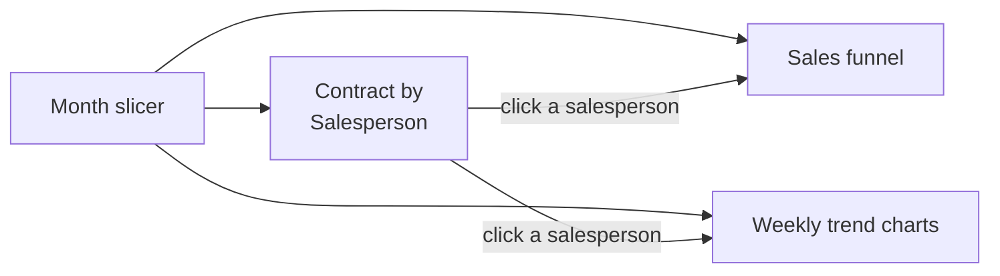

# Sales Funnel Report: A Data Storytelling Approach

## 1. Project Overview

This project is an interactive sales funnel report that follows prospects from the company list through to signed contracts. It shows how many prospects reach each stage, how conversion changes over time, and how each salesperson contributes to closed deals. A month filter and clickable charts let users focus on a period or a person and see the whole story update.

* **Use case:** Tracking sales pipeline performance from prospecting to contract
* **Intended audience:** Sales managers and sales teams reviewing pipeline health and individual performance
* **Main technologies:** Microsoft Power BI (report canvas with funnel, column and area charts, a month slicer, and configured visual interactions)

## 2. Business Problem & Objectives

### Problem

Sales managers need to know where prospects drop out of the pipeline and who is converting them into contracts. When pipeline data sits in lists or spreadsheets, it is hard to see conversion rates between stages, weekly trends or differences between salespeople without building new analysis each time.

### Objectives

* Show the full sales funnel and the conversion rate at each stage
* Show weekly trends for leads, presentations, offers and contracts
* Compare contracts closed by each salesperson
* Let users filter by month and drill into one salesperson's pipeline
* Tell a clear story, from overall results down to individual performance

## 3. Solution

The report is a single page built around five stages of the sales process:

* **Sales funnel:** Company list, Lead, Presentation, Offer and Contract, with counts and the percentage of the starting list at each stage. For example, across January to March, 134 companies lead to 20 contracts (15%).
* **Contract by Salesperson:** A column chart of contracts per salesperson (Peter 6, Alex 5, Mary 5 and Viktor 4 for the full period)
* **Weekly trend charts:** Separate area charts for Leads, Presentations, Offers and Contracts, by week from mid-January to late March
* **Month slicer:** Buttons for January, February and March

### End-to-End Workflow

1. **See the overall story:** With all three months selected, the user sees the complete funnel, total contracts per salesperson and weekly activity for each stage.
2. **Filter by period:** Selecting January and February only updates the funnel (103 companies, 5 contracts, 5%), the salesperson chart and the trend lines. Contracts only begin to appear in the second half of February.
3. **Drill into a salesperson:** Clicking a salesperson filters the funnel and the trend charts to that person's pipeline. For example, Mary over the full period has a company list of 40, 14 leads, 10 presentations, 8 offers and 5 contracts.
4. **Compare people:** Switching between salespeople shows how each one's pipeline differs. For January and February, Alex has 26 companies, 16 leads, 12 presentations and 5 offers, while Viktor has 24 companies, 8 leads, 4 presentations and 3 offers.
5. **Hover for detail:** Tooltips give exact values, such as "Salesperson: Viktor, Sum of Contract: 1".

## 4. Solution Architecture & Technologies

| Component | Role |
|---|---|
| **Microsoft Power BI** | Report authoring and the interactive report page |
| **Funnel chart** | Shows the count and conversion percentage at each sales stage |
| **Column chart** | Compares contracts by salesperson and acts as a filter for the rest of the page |
| **Area charts** | Show weekly trends for leads, presentations, offers and contracts |
| **Month slicer** | Filters the report by January, February or March |
| **Edit interactions** | Configured so the slicer and the salesperson chart control how the other visuals filter |

The original data source is not shown in the demonstration.

## 5. Controls & Validation

This is a reporting solution, so it does not include data entry, approvals or exception handling. The controls that are demonstrated are:

* **Configured visual interactions:** Visual interactions are set up deliberately (shown in edit interactions mode), so the slicer and salesperson chart filter the funnel and trend charts as intended
* **Consistent stage definitions:** Each funnel stage is shown as a count and as a percentage of the starting company list, so conversion is measured the same way for every filter
* **Synchronized views:** The funnel, salesperson chart and trend lines always reflect the same month and salesperson selection

## 6. Business Value

* **Pipeline visibility:** Managers can see at a glance where prospects drop out between stages
* **Performance insight:** Contracts and conversion by salesperson highlight strong performers and where coaching may help
* **Trend awareness:** Weekly charts show when activity rises or falls at each stage
* **Faster analysis:** Filtering by month or salesperson takes one click, with no new reports
* **Clear storytelling:** The layout moves from the overall funnel to individual results, which makes the report easy to present

## 7. Skills Demonstrated

* Sales process analysis and funnel stage definition
* Power BI report design with a data storytelling layout
* Funnel, column and area chart design
* Slicers and cross-filtering for drill-down analysis
* Configuring visual interactions (edit interactions)
* Conversion rate reporting

## 8. Future Enhancements

The following are **potential future enhancements**, not existing functionality:

* **Fix the label:** Correct the "Presetation" stage label to "Presentation"
* **Stage-to-stage conversion:** Show conversion from each stage to the next, not only as a share of the company list
* **Targets:** Add contract targets per salesperson and per month, and show performance against them
* **Deal value:** Add revenue or deal size so the funnel shows value as well as counts
* **Time in stage:** Show how long prospects stay at each stage to spot bottlenecks
* **Publishing:** Publish to the Power BI Service with scheduled refresh for the sales team

---

## Final Summary

The Sales Funnel Report uses Power BI and a data storytelling layout to show how prospects move from the company list to signed contracts. A funnel chart shows counts and conversion at each stage, weekly area charts track leads, presentations, offers and contracts, and a column chart compares contracts by salesperson. A month slicer and clickable charts let managers drill into any period or person to see where deals are won or lost.
