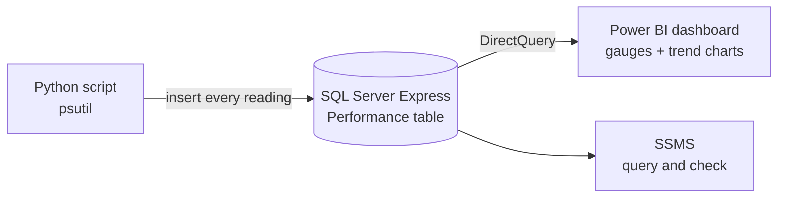

# System Information and Performance Monitoring

## 1. Project Overview

This project collects live performance data from a computer and shows it on a dashboard. A Python script reads CPU, memory, disk and network metrics in a continuous loop and saves each reading to a SQL Server database. A Power BI report connects to that database and shows the current values as gauges, with trend charts over time.

* **Use case:** Near real-time monitoring of a machine's system performance
* **Intended audience:** IT support staff, system administrators, or anyone who needs to keep an eye on how a machine's resources are being used
* **Main technologies:** Python (`psutil`, `pyodbc`, `time`), Microsoft SQL Server Express (database "Information System"), SQL Server Management Studio, Power BI Desktop (DirectQuery) and Visual Studio Code

## 2. Business Problem & Objectives

### Problem

Built-in tools such as Task Manager show how a machine is performing right now, but they do not keep a history in a form that is easy to analyze or share. Without stored readings, it is hard to spot trends, explain slowdowns or show how resources were being used over a period of time.

### Objectives

* Capture key performance metrics automatically, at regular intervals
* Store every reading with a timestamp in a database for later analysis
* Show current CPU, disk and memory usage at a glance
* Show how network traffic and CPU activity change over time
* Keep the dashboard close to real time by querying the database directly

## 3. Solution

The solution has three layers: a Python collector, a SQL Server table and a Power BI dashboard.

**Metrics collected** (using `psutil`)

* CPU usage (%), CPU interrupts and CPU calls
* Memory usage (%), memory used and memory free
* Bytes sent and bytes received over the network
* Disk usage (%)

### End-to-End Workflow

1. **Connect:** The script `performance.py` connects to the **Information System** database on a local SQL Server Express instance using `pyodbc` and Windows authentication (trusted connection).
2. **Collect:** Inside a continuous loop, the script reads the current CPU, memory, network and disk values with `psutil`.
3. **Store:** Each reading is inserted into the **Performance** table with a timestamp (`GETDATE()`). In the demo, a new row is added about once a second.
4. **Check the data:** The table can be queried in SQL Server Management Studio. In the demo the row count grows from 14 to 39 rows while the script runs.
5. **Visualize:** The Power BI report "System Performance" reads the Performance table in DirectQuery mode and shows:
   * **Gauges** for CPU usage, disk usage and memory usage, each with a low and high range value shown under the dial
   * A **line chart** of bytes received and bytes sent over time
   * A **line chart** of CPU calls and CPU interrupts over time
   * A **donut chart** of memory free compared with memory used

## 4. Solution Architecture & Technologies

| Component | Role |
|---|---|
| **Python script** (`performance.py`) | Collects system metrics in a loop and writes them to the database |
| **psutil** | Python library that reads CPU, memory, network and disk statistics |
| **pyodbc** | Connects Python to SQL Server and runs the insert statements |
| **SQL Server Express** ("Information System" database) | Stores each reading in the `Performance` table with a timestamp |
| **SQL Server Management Studio** | Used to query and check the stored performance data |
| **Power BI Desktop** (DirectQuery) | Dashboard with gauges and trend charts that read the table directly |
| **Visual Studio Code** | Development and run environment for the Python script |

## 5. Controls & Validation

This is a monitoring and reporting solution, so it does not include approvals, user input or exception handling. The controls that are demonstrated are:

* **Timestamped records:** Every reading is stored with the database server's time (`GETDATE()`), giving a consistent timeline
* **Structured storage:** Each metric has its own column in the Performance table, which keeps the data consistent and easy to query
* **Secure connection method:** The script uses a trusted (Windows authentication) connection, so no password is stored in the code
* **Data verification:** The stored data is checked directly in SQL Server Management Studio while the collector runs
* **Live reporting:** DirectQuery means the dashboard shows the latest stored data rather than an imported snapshot

## 6. Business Value

* **Better visibility:** Current CPU, disk and memory usage can be seen at a glance
* **Historical insight:** Stored readings make it possible to look back at trends and investigate slowdowns
* **Less manual work:** Metrics are collected and stored automatically, with no manual checks or note-taking
* **Faster troubleshooting:** Trend charts help show when network traffic or CPU activity spiked
* **Reusable data:** Because the data sits in SQL Server, it can be used for other reports or analysis

## 7. Skills Demonstrated

* Python scripting for system monitoring with `psutil`
* Database integration from Python using `pyodbc`
* SQL Server table design and data checks with SQL queries in SSMS
* Power BI dashboard design with gauges, line charts and a donut chart
* DirectQuery connection for near real-time reporting
* End-to-end data pipeline design: collect, store, visualize

## 8. Future Enhancements

The following are **potential future enhancements**, not existing functionality:

* **Fix the connection string warning:** The script shows a `SyntaxWarning: invalid escape sequence '\S'` for `fisher-dillon\SQLEXPRESS`. Using a raw string (`r'...'`) or a double backslash fixes it.
* **Error handling:** Catch connection and insert errors, and reconnect if the database becomes unavailable, so the loop does not stop
* **Alerts:** Notify IT when CPU, memory or disk usage goes above a set threshold
* **Data retention:** Archive or remove old readings so the table does not grow without limit
* **Parameterized queries:** Use query parameters instead of building the SQL statement with string concatenation
* **Multiple machines:** Add a machine name column so several computers can be monitored on one dashboard
* **Configurable interval:** Make the collection interval a setting, rather than fixed in the script

---

## Final Summary

System Information and Performance Monitoring is a small end-to-end data pipeline for tracking how a computer's resources are used. A Python script with psutil records CPU, memory, disk and network metrics into SQL Server about once a second. A Power BI dashboard connected through DirectQuery shows live gauges for CPU, disk and memory usage, along with trend charts. The result is clear, up-to-date visibility of system performance with no manual monitoring.
